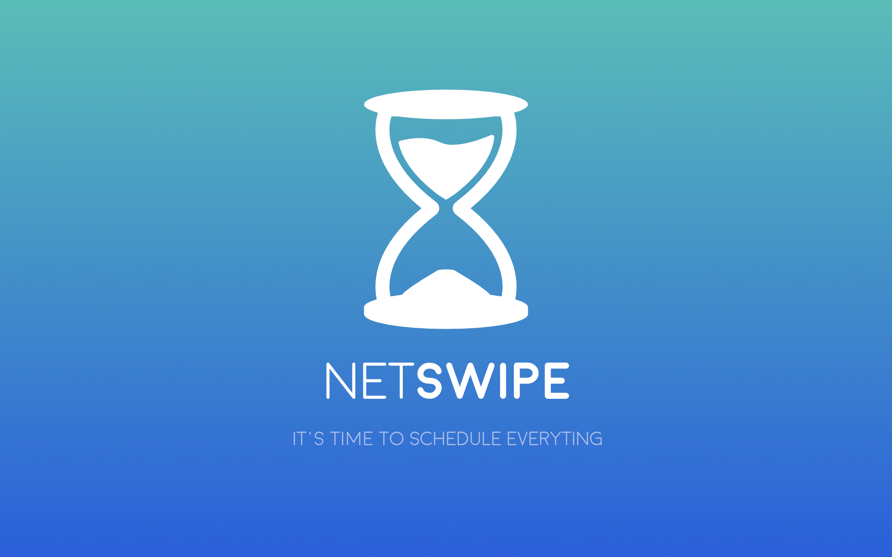

# iesa-2019-b3-mobile-project

## Application : NETSWIPE
### Pitch :

 Escroc dans l’âme, vous avez l’habitude de mettre des alarmes pour envoyer des messages à des heures bien définies. L’objectif ? Piéger et frustrer votre entourage.
 Et si maintenant on vous disait qu’une application vous permettait de programmer ces messages ?

## NetSwipe (Application)

### Nom des co-équipiers
- [Léna Clavier](https://github.com/l-naC)
- [Nolwenn Poilleux](https://github.com/nute-25)
- [Olivier Chemla](https://github.com/olivech12)
- [Abraham Ibo](https://github.com/abrahamibo)
- [Jérémy Grosz](https://github.com/jeremygsz)

## Install & run

Après avoir cloné le projet :

- Dans le terminale mettre la commande suivante pour pouvoir mettre à jour les packages

`npm install`

- Ensuite se placer dans le dossier de votre projet ./sources/netswipe 

- Puis effectuer la commande suivante dans le terminale qui ouvrira le projet dans ton navigateur.:

`ionic serve`

Qui ouvrira le projet dans ton navigateur.

- Afin de lancer le projet avec un device ou un emulator il suffit de faire la commande suivante dans le terminale en ramplacant platform par android ou ios

`ionic serve run platform -l`

